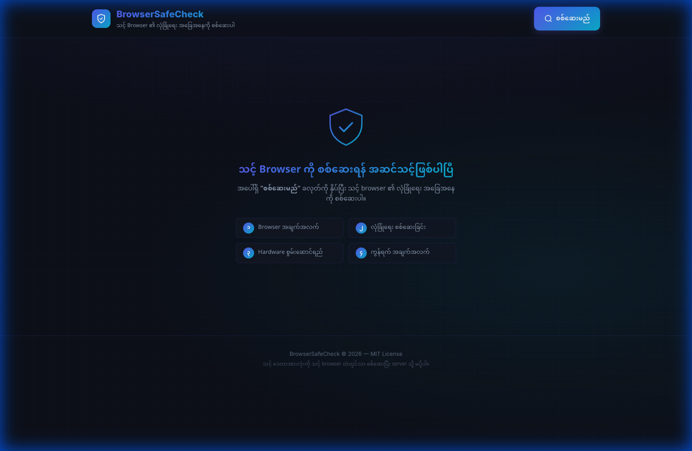
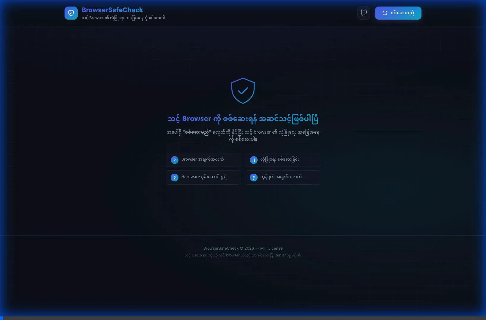

# BrowserSafeCheck 🛡️

**သင့် Browser ၏ လုံခြုံရေး အခြေအနေကို စစ်ဆေးပါ**

A single-page browser security insights tool that performs deep analysis of your browser's security posture and generates a comprehensive report in **Burmese (Myanmar)** language.


## 🎬 Demo

### Welcome Screen



### Live Demo



*The demo shows the complete security scan workflow: clicking the scan button, all 4 categories being analyzed, fingerprinting score calculation, vulnerability check, and actionable suggestions in Burmese.*

## ✨ Features

### 📋 Category 1: အထွေထွေ အချက်အလက် (General Info)
- Browser name, version, and engine detection
- Operating system identification
- Screen resolution & pixel ratio
- Language and platform details

### 🔒 Category 2: လုံခြုံရေးနှင့် ကိုယ်ရေးကိုယ်တာ (Security & Privacy)
- HTTPS connection check
- Secure Context validation
- Cookie status (enabled/disabled)
- Do Not Track (DNT) header
- Ad blocker detection
- Third-party cookie awareness
- **Browser Fingerprinting Score** — Measures browser uniqueness/trackability (0-100)
- **Vulnerability Database Check** — Verifies browser version against known CVEs

### ⚡ Category 3: Hardware နှင့် စွမ်းဆောင်ရည် (Hardware & Performance)
- CPU core count
- Device memory (RAM)
- Battery status & charging state
- JavaScript memory heap usage
- WebGPU support
- Network effective speed

### 🌐 Category 4: ကွန်ရက်နှင့် တည်နေရာ (Network & Location)
- Public IP address detection
- WebRTC IP leak detection
- Timezone identification
- Connection type & speed
- Geolocation permission status
- Online/offline status

### 📊 Security Report
- Overall safety score with animated ring
- Per-category scoring breakdown
- Burmese-language safety verdict
- Actionable suggestions for unsafe items
- Color-coded status badges (✅ Safe / ⚠️ Warning / 🔴 Danger)

### 🔍 Advanced Security Features

#### Browser Fingerprinting Score

- Calculates uniqueness based on 11+ browser attributes (UserAgent, Canvas, WebGL, Plugins, Audio, etc.)
- Score interpretation: <30 = Low risk (Good), 30-60 = Medium risk, >60 = High risk (Dangerous)
- Helps identify how easily websites can track you

#### Vulnerability Database Check

- Checks your browser version against known CVE vulnerabilities
- Supports: Chrome, Edge, Firefox, Safari, Brave
- Recommends updates if your version has security issues

## 🚀 Usage

Simply open `index.html` in any modern browser:

```bash
# Option 1: Direct file open
open index.html

# Option 2: Local HTTP server (recommended for full functionality)
python3 -m http.server 8080
# Then visit http://localhost:8080
```

Click **"စစ်ဆေးမည်"** (Scan) to start the security check.

> **Note:** Some features (like IP detection) require an active internet connection. Running via HTTP server is recommended for all checks to work properly.

## 🔒 Privacy

All checks are performed **locally in your browser**. No personal data is sent to any server except for the public IP check (via `api.ipify.org`).

## 🛠 Tech Stack

- **HTML5** — Semantic markup
- **CSS3** — Dark glassmorphism theme, animations, responsive grid
- **Vanilla JavaScript** — Zero dependencies, all browser APIs
- **Google Fonts** — Noto Sans Myanmar + Inter

## 📄 License

This project is licensed under the [MIT License](LICENSE).
